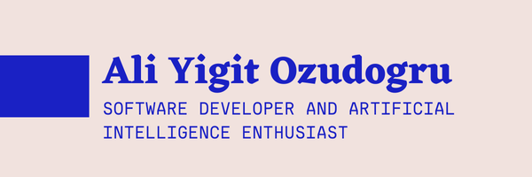

### Hi there 👋, my name is Ali Yigit Ozudogru

### Languages

## 🔧 Technologies & Tools

I made this project just for fun, it allows you to create nice and simple GitHub Readme files that you can copy/paste and use in your profile.

Skills: Python/ C++/ Keras / Tensorflow / Numpy / Pandas / Scikit-learn

- 🔭 I’m currently working on this page. 

## &#x1f4c8; Best GitHub Projects

